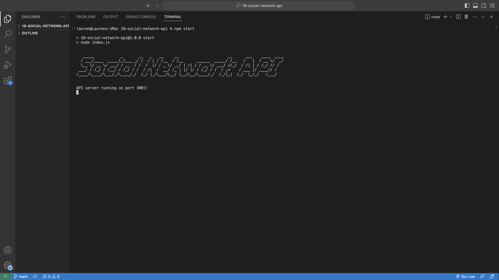

# 18-social-network-api

## Description

Social Network API is a back-end application that allows users to share their thoughts, react to friends’ thoughts, and create a friend list.

## Table of Contents

- [Installation](#installation)
- [Visual](#visual)
- [Usage](#usage)
- [Contributing](#contributing)
- [License](#license)
- [Questions](#questions)

## Installation 

* Clone repo onto your computer
* npm install packages (requires node)

## Visual

## Usage

This application is run from the command line. Invoke the project using the command: 
    
`node index.js`

Then, you can test the application's routes within the Insomnia application. From there, you can view, create, update, and delete users, add or delete friends, view, create, update, and delete thoughts, and add or delete reactions. 

## Contributing

If you would like to contribute to this project, you can create a fork of this repository.

## License

    
## Questions

[My GitHub](https://github.com/lnsvn)

If you have further questions about this application, I can be reached by [e-mail](lsullivan301@yahoo.com)
